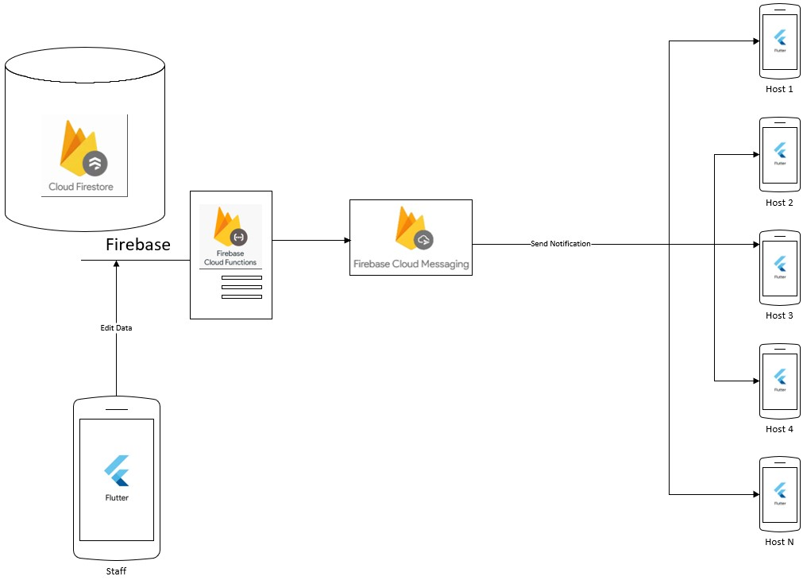

# openCX-cx-t4g1-grupo-1 Development Report

Welcome to the documentation pages of the AdOv of **openCX**!

* Business modeling 
  * [Product Vision](#Product-Vision)
  * [Elevator Pitch](#Elevator-Pitch)
* Requirements
  * [Use Case Diagram](#Use-case-diagram)
  * [User stories](#User-stories)
  * [Domain model](#Domain-model)
* Architecture and Design
  * [Logical architecture](#Logical-architecture)
  * [Physical architecture](#Physical-architecture)
  * [Prototype](#Prototype)
* [Implementation](#Implementation)
* [Test](#Test)
* [Configuration and change management](#Configuration-and-change-management)
* [Project management](#Project-management)


## Team Members

- André Daniel Alves Gomes - up201806224
- Catarina Justo dos Santos Fernandes - up201806610
- Fabio Miguel Chen Huang - up201806829
- Gonçalo André Carneiro Teixeira - up201806562
- Luís Filipe Sousa Teixeira Recharte - up201806743

---

## Product Vision

**A Simple and User Friendly App to provide the best possible schedule organization and adaptation to timetable changes**

---
## Elevator Pitch
Has it ever happened to you getting to a talk in a conference and finding out it was postponed?

Our app, **AdOv**, allows you to check the event schedule and it gives the staff the opportunity to change it in case of a setback, sending a notification to every user on the conference.
Enjoy the extra minutes of coffee break while still showing up on time to the next session!

---
## Requirements

### Use case diagram 


**Check Agenda**
* **Actor**. Attendee
* **Description**. The Attendee can check the conference's agenda 
* **Preconditions and Postconditions**. The Attendee needs to go to the agenda page from a Menu

* **Normal Flow**
  * The Attendee goes to the Agenda page
  * The System fetches the most recent data
  * The System display the data

* **Alternative flows and exceptions**
  * The attendee might want to see the agenda without internet connection, if a talk was changed, the data displayed on the app wont be updated. It will be updated as soon as the attendee establishes internet connection

**Check Notifications**
* **Actor**. Attendee

* **Description**. The attendee can receive notifications and be updated without opening the app

* **Preconditions and Postconditions**. The attendee only needs to turn on the phone screen to see the notification

* **Normal Flow**
  * The system sends a notification describing the change
  * The attendee turns on the phone screen and sees the updates

* **Alternative flows and exceptions**
  * The attendee can tap on the notification to automatically enter the app and see more detailed information. The notification wont be received if the user doesn't have internet connection but will be as soon as he turns it on

**Reschedule Talk**

* **Actor**. Conference host

* **Description**. The conference host can send a notification to the attendees when reschedules a talk

* **Preconditions and Postconditions**. The conference host needs to sign in as a staff member and go to the edit talks tab, reschedule the talk, and submit the changes.

* **Normal Flow**
  * The conference host signs in on the app
  * Goes to the menu choosing the edit talks tab
  * Reschedules the desired talk
  * The system will send a notification to all of the attendees

* **Alternative flows and exceptions**
  * The conference host can change the information without internet connection and the system will ensure that every attendee receives the notification as soon as the conference host turns on the internet

**Change Room**
* **Actor**. Conference host

* **Description**. The conference host can send a notification to the attendees when the room of a talk is changed

* **Preconditions and Postconditions**. The conference host needs to sign in as a staff member and go to the edit talks tab, make the room change and submit the changes

* **Normal Flow**
  * The conference host signs in on the app
  * Goes to the menu choosing the edit talks tab
  * Changes the room of the desired talk
  * The system will send a notification to all of the attendees

* **Alternative flows and exceptions**
  * The conference host can change the information without internet connection and the system will ensure that every attendee receives the notification as soon as the conference host turns on the internet

### [User stories](userstories.md)
**List**:

1. Conference
    * [Show conference preview](userstories.md#Story-4).

2. Timetable
    * [See updated timetable](userstories.md#Story-3).

2. Talk
    * [Show talk details](userstories.md#Story-7).
    * [Update talk room](userstories.md#Story-6).
    * [Reschedule talk](userstories.md#Story-5).
    * [Add Talk](userstories.md#story-14)
    * [Delete Talk](userstories.md#Story-15)

4. Receive notifications
    * [When room changes](userstories.md#Story-2).
    * [When talk is postponed](userstories.md#Story-1).

5. Send notifications
    * [When room changes](userstories.md#Story-8).
    * [When timetable changes](userstories.md#Story-9).

6. Sign in
    * [Sign in as guest](userstories.md#Story-10).
    * [Sign in as staff](userstories.md#Story-11).

8. Home page
    * [Conference information](userstories.md#Story-13).
    * [Next Event](userstories.md#Story-12).


### Domain model


- Our app users can be either **staff members** or **guests**. The staff members organize the conference and the guests attend it.
- **Staff members** are the only ones with credentials as they need to have permission to edit conference information.
- The conference:
  - has a **title**, a **start date**, an **end date** and a **description**.
  - can have one or more **sponsors**.
  - has many **talks**, defined by their **title**, **room**, **date** and **details**.

---
## Architecture and Design


### Logical architecture


The high-level logical structure of our code follows the **Model-View-Controller Architectural Pattern**, also known as the **MVC Pattern**.  
- The **Model** corresponds to the models package in the application. It stores all the relevant data used by AdOv such as talks' time, place and description. 
- The **View** corresponds to the widgets package. It displays the app information and state, for example, the login page, conference schedule page and the talk page.
- Finally, the **Controller** corresponds to the screens package. It's responsible for performing the actions requested by the user and generate the results to be displayed. One example is when a host changes a talk's schedule, the screens package will take care of changing the data so that it can be displayed by the widgets.


### Physical architecture
<div style="text-align:center"></div>

* Cloud Firestore

  It takes the form of a cloud-based NoSQL database server used for storing and syncing data. It's a high-performance database that supports automatic scaling. Besides, it is quite easy to use and very reliable. One of the unique features is the syncing of data across multiple client apps using realtime listeners, used in our app.

* Firebase Cloud Functions

  One of our goals is to send a notification when a important event happens, such as adding a new talk to the database, removing a talk, or editing the details of a talk, and as we are using Firestore to store the data the best option would be to implement the Firebase Cloud Functions. Cloud Functions for Firebase is a serverless framework that lets us automatically run back-end code in response to events triggered by Firebase features and HTTPS requests. The code is written in JavaScript and it is stored in Google's could running in a managed environment.

* Firebase Cloud Messaging

  Changing information on the database triggers the cloud functions, and those functions send a push notification to devices register to a said topic. We register every user on the moment they open the app for the first time to a topic called `Talks`. Therefore, whenever a talk is edited, added or removed, every user connected will receive a notification about that event.

### Prototype

We started off by designing the UI on Figma (these UI prototypes can be found on the user stories' issues), then the question was what the best technology to implement our App, Flutter was the unanimous choice in a set of some technologies such as pure Android (Kotlin) and React Native.

Our approach was a bit of "from the inside out", we developed from the Talk Details Screen to the Welcome Screen.

On the early stages of the app we didn't have a database connection, our data was static, so at a point the question was: "What database architecture should we chose?", and the answer was Firebase Firestore, as described in the previous section. Firestore was chosen in a set of options such as internal SQLite Database and Firebase Realtime Database. Manipulating the data was probably the most challenging task, but as it is a popular new technology, there's a lot of guides and community support on the Web, which made the process a bit easier, but still challenging, as we are going to demonstrate a bit on the next section.

---

## Implementation

On our Home Screen we present a brief of the Conference, information like number of talks, number of days (Conference duration), the next talk, sponsors, and some details about the conference itself. So one thing we wanted is to count the number of talks, and the total number of days. Well, counting the number of talks wasn't so difficult, but counting the number of days was a bit challenging, as we need to return a set of days from all talks. We developed a method to do this in a simple way, here's a snippet:

```dart
await collectionReference.get().then((querySnapshot) {
    Set<DateTime> days = Set();
    querySnapshot.docs.forEach((element) {
        days.add(DateTime(
            element.data()["year"], element.data()["month"], element.data()["day"],
        ));
    });
    conferenceRef.update({"days": days.length});
});
```

This is performed in the back-end and async from the main app. But the main challenge was to get the next talk. This was a interesting feature, we implemented the schedule to highlight the next talk, and also, the next talk is present as a widget on the Home Screen. The method to get the next talk can be found on [Talk.dart](../adov_flutter/lib/models/talk.dart) called `getNextTalk`.

---
## Test


---
## Configuration and change management

For change management we used **Feature Branches** and **Pull Requests** linked to **Issues**. Those **Issues** were assigned to **Milestones**, one for each **Iteration**. This has proven to be very helpful to keep everything organized and the product increment was easier to evaluate based on the Milestones.


---

## Project management

For Project Management we used [Github Projects](https://github.com/FEUP-ESOF-2020-21/open-cx-t4g1-grupo-1/projects/2), automated with Issues and Pull Requests for on-open and review progress, as we established a minimum of 2 member's review to merge a Pull Request, so we all know what's happening and avoid unawareness. You can find the Issues [here](https://github.com/FEUP-ESOF-2020-21/open-cx-t4g1-grupo-1/issues).

---

## Evolution - contributions to open-cx
